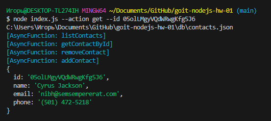
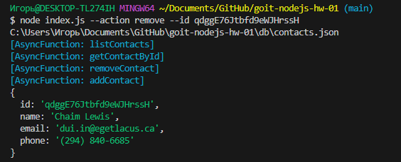

# goit-nodejs-hw-01

Шаг 1
Инициализируй проект с помощью команды npm init
В корне проекта создай файл index.js
Установи пакет nodemon как зависимость разработки (devDependencies)
В файле package.json добавь "скрипты" для запуска index.js
Скрипт start, запускающий index.js с помощью node
Скрипт dev, запускающий index.js с помощью nodemon
Шаг 2
В корне проекта создай папку db. Для хранения контактов загрузи и используй файл contacts.json, положив его в папку db.

В корне проекта создай файл contacts.js.

Сделай импорт модулей fs (в версии, работающей с промисами – fs/promises) и path для работы с файловой системой.
Создай переменную contactsPath и запиши в нее путь к файлу contacts.json. Для составления пути используй методы модуля path.
Добавь функции для работы с коллекцией контактов. В функциях используй модуль fs и их методы readFile() и writeFile().
Сделай экспорт созданных функций через module.exports.
// contacts.js

/*
 * Раскомментируй и запиши значение
const contactsPath = ;
 */

// TODO: задокументировать каждую функцию
function listContacts() {
  // ...твой код. Возвращает массив контактов.
}

function getContactById(contactId) {
  // ...твой код. Возвращает объект контакта с таким id. Возвращает null, если объект с таким id не найден.
}

function removeContact(contactId) {
  // ...твой код. Возвращает объект удаленного контакта. Возвращает null, если объект с таким id не найден.
}

function addContact(name, email, phone) {
  // ...твой код. Возвращает объект добавленного контакта. 
}
Шаг 3
Сделай импорт модуля contacts.js в файле index.js и проверь работоспособность функций для работы с контактами.

Шаг 4
В файле index.js должен импортироваться пакет yargs для удобного парса аргументов командной строки. Используй готовую функцию invokeAction(), получающую тип выполняемого действия и необходимые аргументы. Функция вызывает подходящий метод из файла contacts.js, передавая ему необходимые аргументы.

// index.js
const argv = require('yargs').argv;

// TODO: рефакторить
function invokeAction({ action, id, name, email, phone }) {
  switch (action) {
    case 'list':
      // ...
      break;

    case 'get':
      // ... id
      break;

    case 'add':
      // ... name email phone
      break;

    case 'remove':
      // ... id
      break;

    default:
      console.warn('\x1B[31m Unknown action type!');
  }
}

invokeAction(argv);
Также можно использовать модуль commander для парсинга аргументов командной строки. Это более популярная альтернатива модулю yargs

const { Command } = require('commander');
const program = new Command();
program
  .option('-a, --action <type>', 'choose action')
  .option('-i, --id <type>', 'user id')
  .option('-n, --name <type>', 'user name')
  .option('-e, --email <type>', 'user email')
  .option('-p, --phone <type>', 'user phone');

program.parse(process.argv);

const argv = program.opts();

// TODO: рефакторить
function invokeAction({ action, id, name, email, phone }) {
  switch (action) {
    case 'list':
      // ...
      break;

    case 'get':
      // ... id
      break;

    case 'add':
      // ... name email phone
      break;

    case 'remove':
      // ... id
      break;

    default:
      console.warn('\x1B[31m Unknown action type!');
  }
}

invokeAction(argv);
Шаг 5
Запусти команды в терминале и сделай отдельные скриншоты результата выполнения каждой команды.

# Получаем и выводим весь список контактов в виде таблицы (console.table)
node index.js --action list

# Получаем контакт по id - выводим в консоль объект контакта или null, если контакта с таким id не существует.
node index.js --action get --id 05olLMgyVQdWRwgKfg5J6

# Добавляем контакт и выводим в консоль созданный контакт
node index.js --action add --name Mango --email mango@gmail.com --phone 322-22-22

# Удаляем контакт и выводим в консоль удаленный контакт или null, если контакта с таким id не существует.
node index.js --action remove --id qdggE76Jtbfd9eWJHrssH
Шаг 6 - Сдача домашнего задания.
Сделай скриншоты выполнения команд, которые залей на любой бесплатный облачный сервис хранения картинок (примеры: monosnap, imgbb.com ), и соответствующие ссылки добавь в файл README.md (создай этот файл в корне проекта). Затем прикрепи в LMS ссылку на репозиторий для проверки ментором выполненной работы.

Критерии приема
Создан репозиторий с домашним заданием — CLI приложение
Ссылка на репозиторий отправлена ментору на проверку
Код соответствует техническому заданию проекта
При выполнении кода не возникает необработанных ошибок
Название переменных, свойств и методов записано в нотации СamelCase. Используются английские слова, названия функций и методов содержат глагол
В коде нет закомментированных участков кода
Проект корректно работает с актуальной LTS-версией Node

